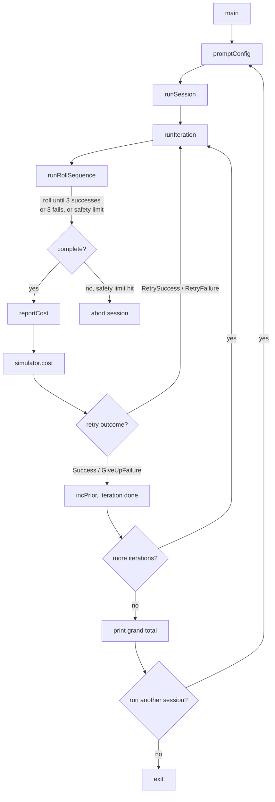

# cap-rnd Developer Guide

This is the developer-facing companion to [README.md](../README.md) (end-user install/usage) and [CLAUDE.md](../CLAUDE.md) (terse orientation for AI coding agents). It covers everything needed to build, extend, test, and contribute to this codebase.

## Table of contents

1. [Architecture](#architecture)
2. [Installation](#installation)
3. [Build instructions](#build-instructions)
4. [Repository layout](#repository-layout)
5. [Design decisions](#design-decisions)
6. [API reference](#api-reference)
7. [Common workflows](#common-workflows)
8. [Troubleshooting](#troubleshooting)
9. [Contribution guide](#contribution-guide)

---

## Architecture

cap-rnd simulates repeated d20 rolls against configurable thresholds, tracking successes/faults/critical-failures per attempt and accumulating cost across completed iterations. The whole program is three translation units with a strict responsibility split:

- **`rnd.h` / `rnd.cpp`** — the simulation engine (`rnd` class). Does **no I/O**. `roll()` and `cost()` return data (a `bool`, a `CostOutcome`) instead of printing; callers read state back via getters. This is the one class in the project.
- **`rndCli.h` / `rndCli.cpp`** — CLI orchestration and all printing. Drives the engine and formats output. Split out from `main()` specifically so it's linkable into the test binary without pulling in a second `main()` (which would collide at link time).
- **`rndMain.cpp`** — just `main()`: the outer "run another simulation?" loop.

Control flow, one simulation session:



`rnd` itself has no knowledge of sessions or iterations — it only knows about the *current attempt* (`successes`/`faults`/`fails`/`totalCost`, cleared by `reset()`) and *session-lifetime* state (`grandTotalCost`, `prior` escalation). The orchestration layer (`rndCli.cpp`) is what turns single rolls into attempts, attempts into iterations (with retries), and iterations into a full session.

## Installation

End users should download a prebuilt binary from the [Releases page](https://github.com/VeryPoly/cap-rnd/releases/latest) — see [README.md](../README.md) for per-platform steps (Windows/Linux/macOS). No installer, no runtime dependencies; extract and run.

For development you need a C++20 toolchain (see [Build instructions](#build-instructions)) — no other tools are required to build and test. `pre-commit` (Python) is only needed if you want local formatting/hygiene checks before pushing; CI runs the same checks regardless.

## Build instructions

Compiler support: GCC 11+, Clang 14+, or Visual Studio 2022+ (C++20 required).

Build the application:

```
g++ -std=c++20 -O2 -Wall -Wextra -Wpedantic rnd.cpp rndCli.cpp rndMain.cpp -o rnd
```

(Clang: swap `g++` for `clang++`. MSVC: `cl /std:c++20 /O2 rnd.cpp rndCli.cpp rndMain.cpp`.)

Build and run tests:

```
g++ -std=c++20 tests/test_basic.cpp rndCli.cpp rnd.cpp -o test_runner
./test_runner
```

Format before committing:

```
./scripts/format.sh
```

The exact same flags are also encoded once, in one place, as the CI composite action: [`.github/actions/build-and-test/action.yml`](../.github/actions/build-and-test/action.yml). If you need to change compiler flags, change them there — `ci.yml`, `build.yml`, and local builds should never drift apart.

## Repository layout

```
.
├── rnd.h / rnd.cpp            # Simulation engine (rnd class) — no I/O
├── rndCli.h / rndCli.cpp      # CLI orchestration, prompting, printing
├── rndMain.cpp                # main() only
├── tests/
│   └── test_basic.cpp         # Single assert-based test binary, no framework
├── scripts/
│   └── format.sh              # Runs clang-format -i over every tracked .cpp/.h
├── docs/
│   └── DEVELOPER_GUIDE.md     # This file
├── .github/
│   ├── actions/build-and-test/  # Composite action: single source of truth for build flags
│   ├── workflows/
│   │   ├── ci.yml               # lint-and-test, sanitize, static-analysis, coverage
│   │   ├── build.yml            # Cross-platform (win/linux/macos) build + artifact upload
│   │   ├── releases.yml         # Tag-triggered: package + checksum + attest + publish
│   │   └── release-drafter.yml  # Drafts release notes from merged PR labels
│   └── dependabot.yml          # Weekly github-actions ecosystem updates
├── .clang-format               # Allman braces, enforced in CI
├── .pre-commit-config.yaml     # clang-format + hygiene hooks, SHA-pinned
├── CLAUDE.md                   # Terse orientation for AI coding agents
├── LICENSE                     # MIT
└── README.md                   # End-user facing: install, usage, mechanics
```

## Design decisions

These are decisions with real reasoning behind them — worth knowing before you change the surrounding code.

**Why the engine does no I/O.** `rnd::roll()`/`cost()` return data instead of printing so the engine is usable headless from tests without capturing stdout or faking a terminal. All formatting lives in `rndCli.cpp`.

**Why `rndCli.cpp` exists as a separate translation unit from `rndMain.cpp`.** The test binary (`tests/test_basic.cpp`) needs `promptInt`/`runSession`/etc. but must not link a second `main()`. Splitting orchestration from the entry point is what makes `tests/test_basic.cpp` + `rndCli.cpp` + `rnd.cpp` a valid, self-contained link.

**Why saturating arithmetic (`safeAdd`/`safeMultiply`) instead of raw `+`/`*`.** Cost accumulates across every iteration in a session (`grandTotalCost`); an unbounded `numRolls` (no upper limit is enforced — see [Troubleshooting](#troubleshooting)) makes overflow a real reachable condition over a long session, not just a theoretical one. Saturating at `LLONG_MIN`/`LLONG_MAX` beats silently wrapping into a negative or nonsensical total. `safeMultiply` asserts both operands are non-negative — every current call site guarantees this (costs are always ≥ 0); if you add a new call site, keep that invariant true or the assert fires.

**Why the `forceNextRoll`/`forcedRolls` test seam instead of a mocking framework.** Some behavior (the 1000-roll safety limit in `runRollSequence`, the 100-retry limit in `runIteration`) is only reachable with dozens to hundreds of *specific, consecutive* roll outcomes in a row — not something real dice can reliably reproduce in a test. Rather than pull in a mocking library, `rnd` exposes one queue (`std::queue<int> forcedRolls`) that `roll()` drains before falling back to the real RNG. Empty by default, so production behavior is untouched; tests preload it via `forceNextRoll()`.

**Why `cost()` asserts instead of silently tolerating misuse.** `cost()` has two real preconditions that aren't enforced by the type system: (1) it must only be called once per un-reset attempt — calling it twice double-adds `totalCost` into `grandTotalCost`; (2) it must only be called once the roll sequence has actually reached a terminal state (3 successes or 3 fails) — calling it early misreports `RetryFailure`/`GiveUpFailure` for an attempt that isn't actually finished. Both held only by caller discipline in the current call graph (`reportCost()` → `cost()`, called exactly once per iteration, always after `runRollSequence()` completes). A `costComputed` guard flag plus a terminal-state assert make violations fail loud in debug builds instead of corrupting state silently. See [rnd::cost()](#rndcost) below.

**Why no exceptions.** Every failure path in this program (retry/safety limit exceeded, malformed input) is handled with a `bool` return + a printed message, matching the rest of the codebase's style. Introducing exceptions for a linear, single-threaded CLI wouldn't simplify anything here.

**Why no build system (CMake, etc.).** Three source files, one test file, three supported compilers, no external dependencies. A raw, single documented compiler invocation is simpler than a generated build system at this scale — revisit if the file count or dependency count grows meaningfully.

**Why table-driven tests for `CostOutcome` and roll boundaries.** `COST_OUTCOME_CASES` and `ROLL_BOUNDARY_CASES` (`tests/test_basic.cpp`) replaced several near-identical test functions that each did "set up state, one action, assert." A `{input, expected...}` table + one loop scales better as more boundary cases get added, and keeps the intent (which inputs map to which outcomes) visible at a glance instead of buried in repeated function bodies.

**Why every GitHub Action is SHA-pinned (and `.pre-commit-config.yaml` hook `rev:`s too).** A tag or branch ref is mutable — a compromised upstream could move it to point at malicious code that then runs in CI with repo write access. Pinning to a commit SHA (with the tag kept as a trailing comment for readability) closes that supply-chain gap; Dependabot keeps the pins current on a weekly schedule.

**Why release artifacts get build provenance attestation.** `releases.yml` runs `actions/attest-build-provenance` against the packaged binaries, producing a Sigstore/Rekor-backed, cryptographically verifiable link between a given release asset and the exact workflow run/commit that built it (`gh attestation verify` on a downloaded asset confirms this). This lets anyone confirm a downloaded binary actually came from this repo's CI, not a tampered upload.

## API reference

### `rnd` (rnd.h / rnd.cpp)

The simulation engine. One instance per session; state is mutated by `roll()`, finalized by `cost()`, cleared per-attempt by `reset()`.

**Constructor** — `rnd(int p, int co, bool kg, unsigned int seed = std::random_device{}())`
Clamps `p` to `[PRIOR_MIN, PRIOR_MAX]` = `[-20, 20]` and `co` to `[COST_OFFSET_MIN, COST_OFFSET_MAX]` = `[-3, 6]`. Precomputes `multiplier = 10^(co+3)` once. `seed` defaults to a real entropy source; tests pass a fixed value for determinism.

**`[[nodiscard]] bool roll()`**
Draws the next roll (from `forcedRolls` if non-empty, else `d20(rng) + prior`), classifies it via `processRoll()`, and returns `true` once the attempt has reached a terminal state (`successes >= 3` or `fails >= 3`). Callers must stop calling `roll()` once it returns `true` without an intervening `reset()`.

**`void processRoll(int rollValue)`**
Classifies one already-computed roll value against the fixed thresholds in `rnd.h` (`PERFECT_SUCCESS=23`, `SUCCESS=18`, `SUCCESS_WITH_FAULT=14`, `FAILURE_THRESHOLD=7`) and updates `successes`/`faults`/`fails`/`totalCost` accordingly. Exposed separately from `roll()` so tests can classify an exact value without going through the RNG.

**`[[nodiscard]] CostOutcome cost()`**
Finalizes the current attempt. **Preconditions** (both `assert`ed): must not have already been called since the last `reset()`; the attempt must be terminal (`successes >= 3 || fails >= 3`). Returns one of:

| `CostOutcome` | Meaning |
|---|---|
| `RetrySuccess` | Succeeded, but a fault or a fail occurred — attempt should be retried |
| `Success` | Succeeded cleanly — attempt is done |
| `RetryFailure` | Failed (3 crit fails), `keepGoing` is true — attempt should be retried |
| `GiveUpFailure` | Failed (3 crit fails), `keepGoing` is false — attempt is done |

`grandTotalCost` is updated only on `Success`/`GiveUpFailure` (the two "final" outcomes) — retried attempts' cost is discarded on the next `reset()`.

**`void reset()`** — clears per-attempt state (`successes`/`faults`/`fails`/`totalCost`/`costComputed`). Does not touch `prior`, `grandTotalCost`, or `multiplier`.

**`void incPrior()`** — bumps `prior` by 1, capped at `MAX_ESCALATED_PRIOR = 7` (independent of the constructor's wider `[-20, 20]` clamp — if `prior` started above 7, this becomes a permanent no-op). Call once per *completed* iteration, not per retry.

**`void forceNextRoll(int rollValue)`** — test-only. Queues an exact value for the next `roll()` call, bypassing the RNG and the `prior` offset entirely.

**Getters** — `getGrandTotalCost()`, `getScaledCost()` (current attempt's cost × multiplier), `getLastRoll()`, `getSuccesses()`, `getFaults()`, `getFails()` — all `const`, all `[[nodiscard]]`.

### `rndCli` free functions (rndCli.h / rndCli.cpp)

**`void promptInt(int& value, bool aboveZero)`** — loops until a valid integer is read (or stdin hits EOF, in which case it returns without touching `value` — callers must default-initialize).

**`void promptBool(bool& result)`** — loops until `y`/`n` (case-insensitive) or EOF (defaults `result = false`).

**`SimConfig promptConfig()`** — prompts for `prior`/`costOffset`/`numRolls`/`keepGoing`, printing a clamp warning if the entered `prior`/`costOffset` falls outside the range `rnd`'s constructor will silently clamp it to.

**`bool runRollSequence(rnd& simulator)`** — calls `roll()` until terminal, printing each roll. Returns `false` if 1000 rolls pass without reaching a terminal state (safety limit — should be unreachable with fair dice, guards against a threshold-logic regression).

**`rnd::CostOutcome reportCost(rnd& simulator)`** — **not a pure report**: calls `simulator.cost()` (a real state mutation) as well as printing the outcome. Returns the outcome for the caller to branch on.

**`bool runIteration(rnd& simulator)`** — runs roll-sequence → cost → retry-if-needed, up to `MAX_RETRIES = 100` times. Returns `false` if either the safety limit or the retry limit is exceeded (both print to `stderr` and end the whole session, not just this iteration).

**`bool runSession(const SimConfig& config)`** — constructs one `rnd`, runs `config.numRolls` iterations, prints the grand total. Returns `false` if any iteration fails.

## Common workflows

**Add a new roll outcome tier** (e.g. a new threshold band): add the constant in `rnd.h` near the existing `static constexpr int` thresholds, add the branch in `rnd::processRoll()` (rnd.cpp), add a case to `ROLL_BOUNDARY_CASES` in `tests/test_basic.cpp`, rebuild and run tests.

**Add a new test case for an existing table** (`ROLL_BOUNDARY_CASES` or `COST_OUTCOME_CASES` in `tests/test_basic.cpp`): just add a row — no new function needed. Both tables are iterated by a single loop already.

**Add a genuinely new test function**: write `static void testX()` in `tests/test_basic.cpp`, call it from `main()`. There's no test-selection mechanism — the whole binary always runs everything, in the order `main()` calls them.

**Run the full local check before pushing** (mirrors what CI's `lint-and-test` job does):
```
./scripts/format.sh
g++ -std=c++20 -O2 -Wall -Wextra -Wpedantic rnd.cpp rndCli.cpp rndMain.cpp -o rnd
g++ -std=c++20 -O2 -Wall -Wextra -Wpedantic tests/test_basic.cpp rndCli.cpp rnd.cpp -o test_runner
./test_runner
printf "0\n0\n1\nn\nn\n" | ./rnd
```

**Cut a release**: merge whatever should go out, confirm `main`'s CI is green, tag `vX.Y.Z` at `main`'s HEAD (release-drafter maintains a draft release with the next version and changelog from merged PR labels — check it via the Releases page before picking a version number), push the tag. `build.yml` builds all 3 platforms and uploads artifacts; `releases.yml` (tag-triggered) downloads them, packages zip/tar + `checksums.txt`, attests provenance, and publishes via `softprops/action-gh-release`. Mark it `--latest` once you've confirmed all 4 assets are present and both workflows succeeded.

**Update GitHub Actions dependencies**: Dependabot opens PRs weekly against the `github-actions` ecosystem automatically — review the diff (it'll re-pin to a new SHA with an updated tag comment), let CI run, merge like any other PR.

## Troubleshooting

**`clang-format --dry-run --Werror` fails in CI / pre-commit rejects your commit** — run `./scripts/format.sh` and re-stage; it runs `clang-format -i` over every tracked `.cpp`/`.h` file.

**Sanitizer (ASan/UBSan) build won't compile locally on Windows/MinGW** — MinGW doesn't ship `libasan`/`libubsan`. This is expected; rely on CI's `sanitize` job (runs on `ubuntu-24.04`) for sanitizer coverage rather than trying to reproduce it locally on Windows.

**An `assert()` fires inside `rnd::cost()`** — this means a real precondition violation, not test flakiness: either `cost()` was called twice without an intervening `reset()`, or it was called before the attempt reached a terminal state (see [API reference](#rndcost)). Find the caller that broke one of these invariants; don't silence the assert.

**A session run with no input at all (piped empty stdin) behaves oddly** — check `SimConfig`'s defaults (`rndCli.h`): if stdin hits EOF before any input, `promptInt`/`promptBool` return without touching their target, so the struct's default member initializers (all zero/false) are what's actually used. If you add a new `SimConfig` field, it must have a default member initializer for the same reason.

**cppcheck flags something in CI** (`static-analysis` job) — check `.github/workflows/ci.yml` for the current suppression list (`missingIncludeSystem`, `shadowFunction`, `unusedStructMember`) before adding a new suppression; these were each verified as false positives (multi-TU analysis limitations / a local variable legitimately named the same as a method), not blanket-suppressed.

**Windows build step behaves differently from Linux/macOS in `build.yml`** — the Windows job produces `rnd.exe`/`test_runner.exe` and uses PowerShell (`pwsh`) syntax for its smoke-test/verify steps (e.g. `` "0`n0`n1`nn`nn" `` instead of `printf`); this is intentional, not a bug, matching `matrix.output`/`matrix.test_output` per-OS in the workflow.

**A very large `numRolls` makes the session take a long time** — there's no upper bound enforced on `numRolls` (only a `> 0` check); this is a known, accepted tradeoff (see [Design decisions](#design-decisions)), not a bug.

## Contribution guide

1. **Fork/branch, make your change, open a PR against `main`.** Draft PRs are fine while work is in progress.
2. **Format before pushing**: `./scripts/format.sh`. CI enforces `clang-format --dry-run --Werror`; a diff there will fail the build.
3. **Add tests for behavior changes.** This project has no framework — plain `assert` in `tests/test_basic.cpp`, called from `main()`. Prefer extending an existing table (`COST_OUTCOME_CASES`/`ROLL_BOUNDARY_CASES`) over writing a near-duplicate function when your case fits the same shape.
4. **All CI checks must pass before merge**: `lint-and-test`, `sanitize`, `static-analysis`, `coverage`, and cross-platform `build` (Windows/Linux/macOS) — 7 checks total.
5. **Explain the *why*, not just the *what*, in commit messages.** This codebase favors commit messages and PR descriptions that state the reasoning (see [Design decisions](#design-decisions) for the standard this project holds itself to) over restating the diff.
6. **Keep changes surgical.** Touch only what the change requires; don't fold in unrelated formatting or refactors alongside a behavior change — keep those as separate commits/PRs so each is independently reviewable.
7. **License**: contributions are made under the project's [MIT License](../LICENSE).
